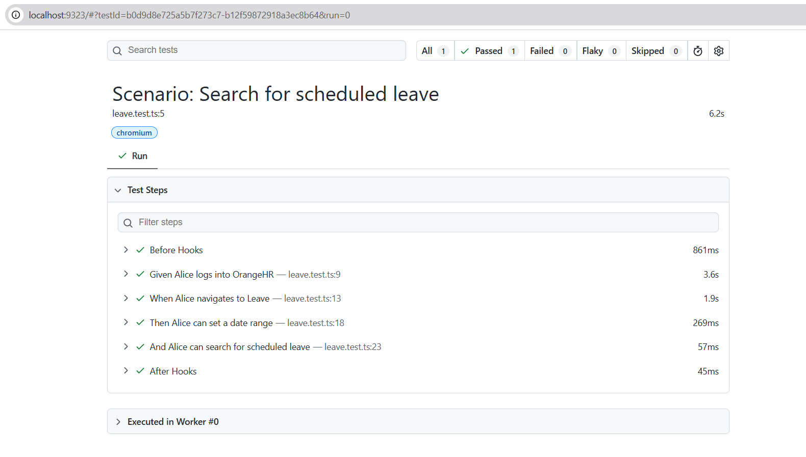

# OrangeHRM Test Automation – Clue Software Technical Assessment

## Overview

A test automation framework built with Playwright and TypeScript, implementing an end-to-end test scenario for the Leave section of OrangeHRM.

---

## Tech Stack

| Tool | Reason |
|------|--------|
| Playwright | Fast, reliable, built-in auto-waiting, excellent TypeScript support |
| TypeScript | Type safety, better code readability and maintainability |
| Node.js 18+ | Required runtime for Playwright |

## Why Playwright?

- **Auto-waiting** — Playwright waits for elements to be ready before interacting, reducing flaky tests
- **Built-in reporting** — HTML report generated out of the box, no extra setup needed
- **TypeScript-first** — Strong typing makes page objects clean and maintainable
- **Cross-browser** — Runs on Chromium, Firefox and WebKit with no extra configuration

---

## Project Structure
orangehrm-assessment/
├── pages/
│   ├── LoginPage.ts        # Login page object
│   └── LeavePage.ts        # Leave page object
├── tests/
│   └── leave.test.ts       # Test scenario
├── .env                    # Environment variables (not committed to GitHub)
├── .gitignore              # Excludes node_modules, .env and test output from GitHub
├── playwright.config.ts    # Playwright configuration
├── package.json            # Project dependencies
├── README.md               # Project documentation
├── test-results.png        # Test execution output screenshot
└── tsconfig.json           # TypeScript configuration

---

## Test Scenario

**Scenario: Search for scheduled leave**
Given Alice logs into OrangeHR
When Alice navigates to Leave List
Then Alice can set a date range
And Alice can search for scheduled leave

---

## Setup & Installation

1. Clone the repository:
```bash
git clone https://github.com/jmreddy1216/orangehrm-assessment.git
cd orangehrm-assessment
```

2. Install dependencies:
```bash
npm install
```

3. Install Playwright browsers:
```bash
npx playwright install
```

4. Create a `.env` file in the root with the following:
ORANGEHR_USERNAME=Admin
ORANGEHR_PASSWORD=admin123

---

## Running the Tests

Run all tests:
```bash
npx playwright test
```

Run in headed mode (watch the browser):
```bash
npx playwright test --headed
```

View the HTML report:
```bash
npx playwright show-report
```

---

## Test Execution Output



---

## Notes

- Uses the Page Object Model (POM) pattern for maintainability
- Credentials are stored in a `.env` file and not committed to GitHub
- Tests are resilient to minor UI changes through semantic locators